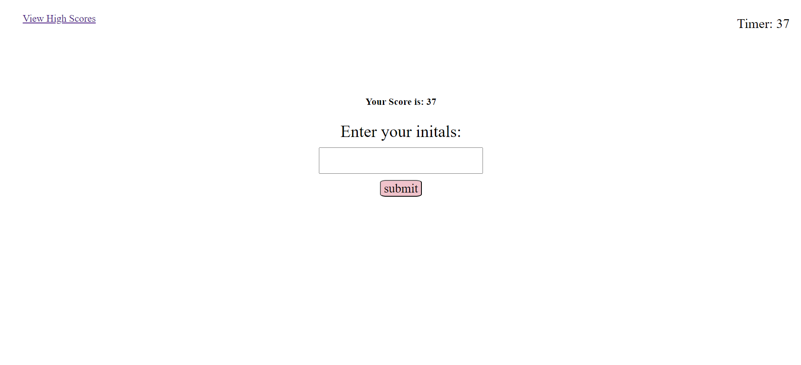

# JavaScript Fundamentals Quiz - Module 4 Challenge

## Description

This application is a 5 question quiz about JavaScript. When the page is loaded, the user will see the title and instructions for the game, as well as the 'start quiz' button. The player will have 45 seconds to complete the quiz, and anytime they get an answer wrong 10 seconds/points are subtracted from the timer. The player's score will be equal to the timer value when they complete the last question of the quiz. After they answer the last question, the screen will change to show them their score, and ask for input of their initials. After entering initials, the player will be asked if they'd like to play again or if they'd like to move to viewing the list of high scores. The score and initial for each game will be stored in local storage and is retrieved to be displayed in the 'High Scores List'. 

Through building this web application, I gained a much deeper understanding of Javascript fundamentals. Some of the things I now feel I have a basic but solid understanding of are: how to connect to specific elements in the HTML, the difference between building a function and calling it, comparison statements, arguments, adding event listeners, and classList edits. 

## Installation

No installation is required by the user in order to interact with this application.

## Usage

When the user initially loads the page, they will see a 'Start Quiz' button that both begins asking the quiz questions, and also prompts the timer to start counting down. When the user is displayed a question, they will need to click on the answer choice they feel is most appropriate. After their click, the next question will be loaded, and a message regarding the accuracy of their last answer choice is displayed below answer choices of new question. When the quiz is completed, the user will be able to enter initials to pair with their score, this way they are able to keep track of their's and their peers results in the 'High Scores List'.

### The following images relfect each different screen display the user will see when moving through this application, in order.

## Link to Deployed Application

[Click Here to take the quiz!](https://mmw18.github.io/JavaScript-Quiz/)